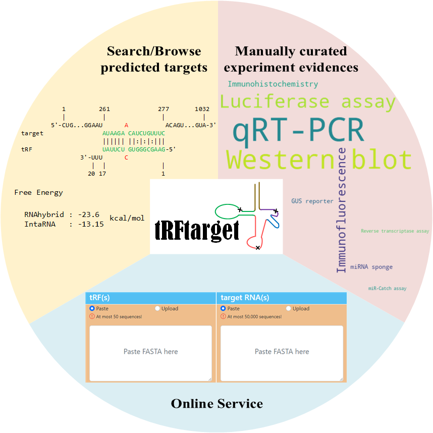

# tRFtarget

**tRFtarget** (http://trftarget.net/) integrates **computational predicted** and **experimental validated** binding interactions between transfer RNA-derived fragments (tRFs) and target transcripts for multiple organisms.

Users can:

* Search or browse predicted tRF targets
* Run our pipeline [tRFtarget-pipeline](https://github.com/ZWang-Lab/tRFtarget-pipeline) to get targets of tRFs or other small non-coding RNAs (such as miRNAs) locally or via our web service in [http://trftarget.net/online_targets](http://trftarget.net/online_targets)
* Browse experimental evidences of the predicted tRF-RNA interactions based on manually curated publications

## Citation

If you use tRFtarget or tRFtarget pipeline, please cite:

Ningshan Li, Nayang Shan, Lingeng Lu, Zuoheng Wang. tRFtarget: a database for transfer RNA-derived fragment targets. *Nucleic Acids Research*, 2020, gkaa831. https://doi.org/10.1093/nar/gkaa831.

## Contact Us
Users are welcome to send feedbacks, suggestions or comments on the tRFtarget database, and report tRF target experiments that are not included in the database through [Issues](https://github.com/ZWang-Lab/tRFtarget/issues).

For issues in using tRFtarget pipeline, please report to GitHub repository [tRFtarget-pipeline](https://github.com/ZWang-Lab/tRFtarget-pipeline).
